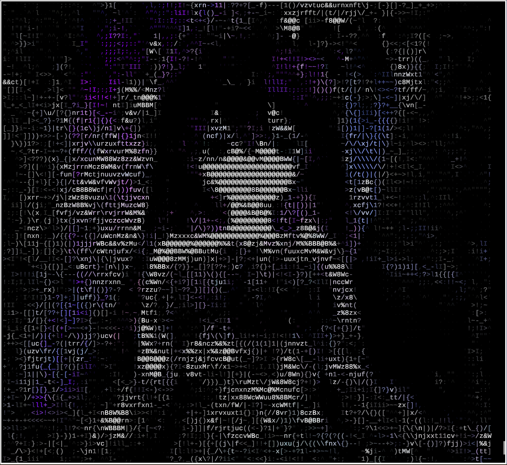
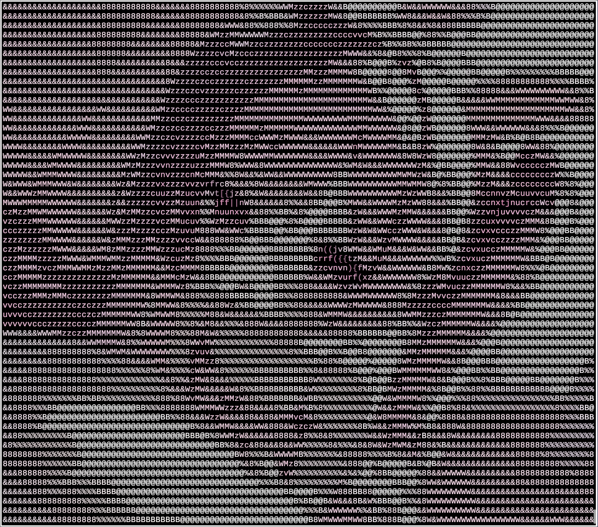
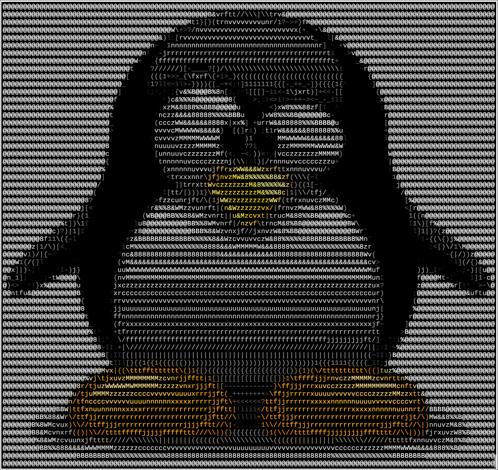

# 🎨 askimg


A high-performance CLI tool to convert images into vibrant ASCII art. 
Optimized for **Linux**, **macOS**, and **Termux (Android)** with TrueColor support and ImageMagick 7.

---

### ✏️ 🎨 Why askimg?

*  **Magick++ Engine**: Supports JPG, PNG, WebP, GIF, SVG, and more.
*  **Precision Palette**: Uses a 70-character density map for better shading.
*  **Hyprland-inspired UI**: Beautifully colored help and error messages.

---

### 🛠️ Building from Source

Since `askimg` relies on ImageMagick, building from source is the recommended method to ensure compatibility across different architectures.

### Prerequisites

You need a C++ compiler (`g++` or `clang++`), `make`, and `ImageMagick` development headers.

#### 🐧 Linux

**Gentoo** (ensure flags: `cxx jpeg png webp`):

```bash
sudo emerge --ask media-gfx/imagemagick dev-util/pkgconf
```

**Arch Linux**:

```bash
sudo pacman -S base-devel imagemagick
```

**Debian / Ubuntu / Mint**:

```bash
sudo apt update && sudo apt install build-essential pkg-config libmagick++-dev
```

**Fedora**:

```bash
sudo dnf install make automake gcc gcc-c++ kernel-devel ImageMagick-c++-devel
```

**🔖 🍏 macOS**
# Install via Homebrew:

```brew
brew install imagemagick pkg-config make
```


**🔖 🤖 Android (Termux)**

# Open Termux and run:

```bash
pkg update && pkg upgrade
pkg install clang make pkg-config imagemagick
```

————————

### 📚 Compilation & Installation

# Once dependencies are installed, the process is the same for all platforms:

# 1. Clone the repository:

```bash
git clone https://github.com/kiberrrxx/askimg.git
cd askimg
```

# 2. Build:

```bash
make
```

# 3. Install (Global):

```bash
sudo make install PREFIX=/usr
```

# (On Termux, just run make install, do not use sudo or prefix).

————————

##✏️ 🚀 Usage

```shell
Flag      | Description                        
----------+------------------------------------
-w <n>    | Set width (default 100)            
-h <n>    | Set height (overrides auto-scaling)
-c        | TrueColor mode (24-bit ANSI)       
-i        | Invert luminance                   
-o <file> | Save clean ASCII text to a file    
-v        | Show version                       
```

##📚 📚 Examples:

#View image in terminal with colors:

```bash
askimg -c -w 120 photo.jpg
```

# Convert to 75x75 square and save to file:

```bash
askimg -w 75 -h 75 -o art.txt image.png
```

————————

---

## 🖼️ Gallery

<p align="center">
 
 <br>
 
 <br>
 
 <br>
 
</p>

---

### 📚 Made, written and compiled by me (kiberrrxx)

### 📌 Created with ❤️ for the Linux community.

## ✏️ 📄 License

# This project is licensed under the MIT License - see the LICENSE file for details.
